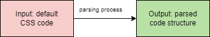

### CSS parser project

crates.io: https://crates.io/crates/css-parser-project

docs.rs: https://docs.rs/css-parser-project/0.2.0/css_parser_project/

### General description
This is a parser program, developed on Rust, that will parse the CSS code (its structure, selectors, properties and basic values). 

### Technical description of parsing process
This parser processes the CSS rules and breaks it into selectors and structures. The grammar includes selectors, values, properties. Parser takes the input CSS code, and on the base of rules creates structure, and saves it to the output like "selector -> declaration" (like the table key:value).

### Example CSS input
```CSS
.header {
    color: blue;
    color: #765abc;
    margin: 10px;
    padding: 20px;
}
```



### Grammar
css_block = { selector ~ WHITESPACE* ~ "{" ~ WHITESPACE* ~ properties ~ WHITESPACE* ~ "}" }

selector = { 
    ("#" ~ ASCII_ALPHANUMERIC+ 
    | "." ~ ASCII_ALPHANUMERIC+ 
    | ASCII_ALPHANUMERIC+)
}

property = { identifier ~ ": " ~ value ~ ";" }

properties = { property+ }

value = { color | dimension | identifier }

dimension = { DIGIT+ ~ ("." ~ DIGIT+)? ~ (("px" | "em" | "%" | "pt")) }

DIGIT = { '0'..'9' }

hex_color = { 
    "#" ~ hex_digit ~ hex_digit ~ hex_digit ~ hex_digit ~ hex_digit ~ hex_digit 
}

hex_digit = { "0" | "1" | "2" | "3" | "4" | "5" | "6" | "7" | "8" | "9" | "a" 
| "b" | "c" | "d" | "e" | "f" }

color = { "blue" | "red" | "green" | "yellow" | "black" | "white" | hex_color }

identifier = { ASCII_ALPHANUMERIC+ }

WHITESPACE = _{ " " | "\t" | "\n" | "\r" }
